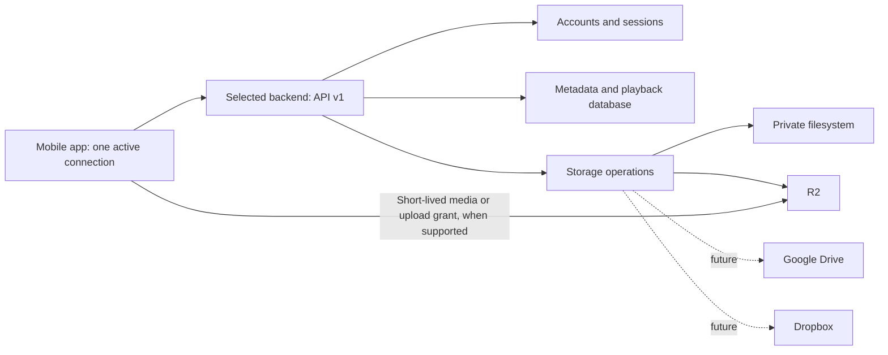

# Bring your own backend: implementation plan

Status: proposal only. Reviewed on September 21, 2026. This document is the only deliverable; no application, backend, Docker, dependency, or infrastructure changes are part of this task.

## 1. Recommended architecture and scope

Keep the existing Next.js backend and its `/api/v1` contract. Make the mobile API client select a backend at runtime. Package the same backend source as a Docker image, with local SQLite and private filesystem storage as the recommended self-hosted configuration. Preserve Turso and R2 support for the operated cloud service and for self-hosters who prefer those services.

Backend selection and storage selection are separate:

| App choice | Server implementation | Authentication | Where audio lives |
| --- | --- | --- | --- |
| Hosted cloud | Our operated backend, using the existing codebase | Account on our service | Operator-configured storage, initially R2 |
| Self-hosted | Our released Docker image | Separate account on that installation | Local filesystem by default; R2 optional |
| Custom backend | Someone else's implementation of the published API | Account on that server, using a supported contract | Whatever that implementation supports |

Google Drive or Dropbox would be a storage connection behind one of these backends. They do not replace the backend's accounts, authorization, metadata database, library API, or playback history.

Assumptions and deliberate limits:

- One backend and one account are active at a time. Initially retain the hosted connection and one configurable self-hosted/custom connection. A list of many saved servers, concurrent libraries, federation, and automatic account/data migration are outside the first release.
- Self-hosted users control their accounts and data independently. Matching email addresses on two servers do not imply shared identities.
- First-release custom backends implement our OTP/session contract. An arbitrary URL, file share, Drive folder, WebDAV endpoint, or unrelated REST API is not automatically compatible.
- Preserve the app's existing local-file experience. Connecting, switching, or disconnecting must not remove independently imported local files.
- Production connections use HTTPS, including private deployments reachable through a VPN. Plain HTTP is a documented development-only exception, not a production toggle.
- Initial self-hosting targets one Linux host and one application process. A reverse proxy handles TLS. No new Redis, PostgreSQL, object-store container, Kubernetes, or separate worker is required.
- Keep email OTP and Resend for the first release. Thus the default self-hosted installation has local data but still needs an operator-supplied email service. SMTP can be a follow-up without changing the mobile authentication protocol.

## 2. What exists today

The mobile repository is this directory; backend paths below are relative to `../web`, located at `/Users/sebastian/Desktop/TEMP/podcast/web`. Both working trees were clean at review start. TokenSave reported the mobile index approximately eight hours old and one commit behind, and the backend index approximately four days old. The findings below were checked against files on disk; neither index was updated. Existing planning documents are not evidence that a feature has been implemented.

| Area | Observed implementation | Consequence for this work |
| --- | --- | --- |
| Mobile runtime | [package.json](package.json) uses Expo `~57.0.20`, React Native `0.86.3`, SecureStore, FileSystem, and a custom Android Auto module. | Use Expo 57 APIs and verify real native playback/background behavior. No SDK upgrade is required. |
| Backend address | [src/services/api.ts](src/services/api.ts) reads `EXPO_PUBLIC_API_ORIGIN` and appends `/api/v1`. [app.config.js](app.config.js) also places the value in Expo extra config. | Address selection is currently build-time. Replace the runtime dependency on a single environment value; retain it as the hosted default. |
| Sessions | [auth-session-storage.ts](src/services/auth-session-storage.ts) has one global session key, using SecureStore on native and AsyncStorage on web. [auth-context.tsx](src/contexts/auth-context.tsx) refreshes tokens, loads the library, and publishes car playback sources. | Sessions, refreshes, state updates, and car snapshots need a connection identity. Changing only the URL is unsafe. |
| Cached state | Remote list/file caches use user ID; local remote playback progress uses audio ID; remote playlist references and Android Auto media IDs contain audio ID without server identity. | Colliding IDs across servers can mix files, progress, queues, and playlists. Scope all remote state. |
| Mobile API | [app/api/v1](../web/app/api/v1), [docs/mobile-api.md](../web/docs/mobile-api.md), and [docs/openapi.json](../web/docs/openapi.json) already cover authentication, profile, library, uploads, metadata, streaming, and playback. | Extend and publish this contract; do not introduce a second API stack. No discovery or health endpoints were found. |
| Backend framework | [package.json](../web/package.json) uses Next.js `16.3.5`, Drizzle, and `@libsql/client`; routes use the Node runtime. | A normal Node deployment is appropriate. Static export cannot serve this API. |
| Database | [db/index.ts](../web/db/index.ts) requires Turso URL/token when `NODE_ENV=production`; otherwise it uses `DATABASE_URL` or a local file. | Production SQLite needs a configuration change. Running Docker in development mode is not a solution. |
| Migrations | [scripts/migrate.ts](../web/scripts/migrate.ts) applies `drizzle/sqlite`. Older migrations also exist in the top-level `drizzle` directory. Migration tooling currently uses the development dependency `tsx`. | Ship the active migration history and an executable migration command; never apply both migration trees. |
| Authentication | [lib/auth.ts](../web/lib/auth.ts) uses email OTP, HMAC-hashed opaque tokens, 15-minute mobile access tokens, rotating refresh tokens, and a fixed 30-day refresh deadline. Web sessions use HttpOnly cookies. | Reuse the established mechanism. Preserve rotation, expiry, and revocation semantics. |
| Provisioning and limits | OTP verification creates users with the `user` role. [lib/audio-service.ts](../web/lib/audio-service.ts) hardcodes six active audios and two saves per UTC day for non-admins. | Self-hosting needs a registration policy and independent quota configuration; making everyone an admin would weaken ownership protections. |
| Storage | New saves/uploads call R2 directly through [utils/r2.ts](../web/utils/r2.ts). Audio rows have `storageKey`, `localPath`, and `source`. | Local reads exist, but setting `AUDIO_ROOT` does not enable local saves/uploads. Add a complete local storage path. |
| Media transfer | [lib/api.ts](../web/lib/api.ts) returns presigned R2 stream URLs or a relative authenticated stream route. [lib/audio-stream.ts](../web/lib/audio-stream.ts) supports range reads. Uploads use grant → raw PUT → completion. | Preserve direct R2 transfers and the existing upload shape. Add local upload grants and refreshable media URLs. |
| Processing | [utils/audio_getter.ts](../web/utils/audio_getter.ts) calls Spotify, RSS/iTunes, YouTube, yt-dlp, and FFmpeg. Work is synchronous. yt-dlp can currently download its latest binary at runtime. | Docker must include working executables and bound processing resources. A restart can interrupt a save; there is no durable job system today. |
| Deployment | [next.config.ts](../web/next.config.ts) lacks standalone output. The Vercel build runs production migrations and configures R2 CORS. No Dockerfile, Compose file, or dockerignore was found. | Docker requires explicit packaging, runtime configuration, deployment migrations, and a reverse proxy recipe. |
| Web and security | The API has database-backed rate limits; `clientAddress` trusts forwarded headers. No explicit API CORS policy was found. The backend layout includes Vercel Analytics. | Proxy trust, browser access, and telemetry need deployment-specific settings. Existing R2 upload CORS does not provide API CORS. |
| Tests | Backend tests exercise routes against an isolated database and validate OpenAPI route coverage. Mobile tests cover playback, uploads, caching policies, reconciliation, and Android Auto behavior. | Extend these tests with connection isolation and actual container/network tests; handler tests alone cannot validate proxy/CORS/TLS behavior. |

The required [Expo 57 reference](https://docs.expo.dev/versions/v57.0.0/) was reviewed. Versioned documentation, rather than older Expo examples, should remain the implementation reference.

## 3. Mobile connection model and user flow

### 3.1 Connection configuration

Introduce a small persisted connection record with a schema version, generated local `connectionId`, kind (`hosted`, `selfHosted`, `custom`), display label, normalized origin, last observed server instance ID, negotiated API major, and discovery/capability snapshot with a timestamp. Persist the active connection ID separately. Do not store tokens in this record.

The local ID identifies a specific trusted origin. It must not be derived solely from a server-supplied ID, label, email, or user ID. Treat an origin edit as a new connection requiring discovery and authentication. Initially use origin-root deployments only; do not support arbitrary path prefixes and reverse-proxy rewrites.

Store nonsecret configuration in AsyncStorage. Use SecureStore keys derived from a safe connection ID for native credentials. Keep tokens bound to both the connection and returned account. Cache identities use `(connectionId, userId, audioId)`, omitting audio ID where the value covers the whole account. For storage-key and native-media-ID encoding, use an unambiguous structured representation or encoded components rather than concatenating unescaped user-controlled strings.

Create a backend provider above `AuthProvider` in `src/app/_layout.tsx`. It owns connection restoration, discovery, switching, and a monotonically increasing connection generation. Create a small API client instance bound to an immutable origin and generation. Pass that client into authentication/upload operations; avoid a mutable module-global URL that can change halfway through a refresh or upload.

### 3.2 Connect flow

1. Add a **Backend** section in Profile, visible before sign-in. Offer Hosted cloud, Self-hosted, and Custom backend. Explain that self-hosted runs our server while custom must implement our API.
2. Hosted uses the configured service origin. Self-hosted/custom request a server URL and optional local label. Show the full destination hostname before requesting an email or uploading anything.
3. Trim whitespace and parse with the URL parser. Default an omitted scheme to HTTPS. Normalize host casing, default ports, and trailing `/`; preserve a nondefault port. Accept a pasted exact `/api/v1` suffix only by showing that it will become the origin. Reject other paths, query strings, fragments, embedded username/password, invalid ports, and non-HTTP(S) schemes.
4. Make an unauthenticated, bounded request to `GET /api/v1/server-info`. Proposed discovery limits: ten-second timeout, at most 64 KiB, valid JSON, and schema validation. No tokens, email, device ID, or hosted-service lookup accompanies this probe.
5. Do not silently follow discovery to another origin. Report the suggested canonical address and require a fresh connection action for it. Authenticated API requests must reject unexpected redirects; verify enforcement in the actual native HTTP stacks.
6. Validate supported API major, discovery revision, required capabilities, and at least one supported auth method. Display server label, origin, compatibility, and available features. The label is untrusted text; never use it as proof that a server is operated by us.
7. On **Connect**, authenticate against this candidate using its own API client. Preserve the old active connection if discovery/authentication fails. For a first connection, remain in local-only mode until success.
8. On successful authentication, perform the switch procedure below, activate the candidate, and fetch `/me` and the first library page. Show the selected server in Account and connection settings.
9. Distinguish invalid address, certificate failure, unreachable host, wrong API path, incompatible API, unsupported auth, denied registration, expired session, and maintenance. A server outage must not automatically select hosted cloud or send data there.

A custom server without discovery is incompatible for the initial release. Deploy discovery to hosted cloud before releasing the switching UI. Existing app versions do not need discovery and can continue using unchanged v1 routes.

### 3.3 Switching without crossing account boundaries

Use a staged switch, with the old connection still active during the credential-free probe and candidate sign-in. Once the target is ready:

1. Stop remote playback and prevent new remote operations. Save pending progress using the old connection identity, with a bounded flush; never resend it to the destination.
2. Cancel fetches, file uploads/downloads, and timers where supported. Increment the generation and reject results from any earlier generation, including token refresh writes, upload completions, cache listeners, and car catalog updates. Native transfers that cannot be stopped may finish only into their old isolated namespace and must not reactivate old playback.
3. Clear in-memory remote library/player state, remote queue entries, resolved URLs/headers, Android Auto registries, the persisted native remote catalog, and remote playback-session bookkeeping. Coordinate with the native player service so an already queued car command cannot play an old credential-bearing source.
4. Persist and activate the destination connection/session, then repopulate its library. Serialize configuration/session writes and make startup recover to a coherent connection after interruption.
5. Retain the inactive connection's session and offline cache under its own namespace. Inactive audio is not part of the active library. Switching back may resume its session after validation/refresh. Explicit **Sign out** revokes where reachable and clears that account's credentials/private downloaded cache; **Forget server** removes its connection data and caches. Local imported files and playlist definitions remain.

Remote playlist references gain connection and account identity. Preserve mixed local/remote playlists; show inactive-server entries as unavailable instead of resolving the same audio ID on the new server. Apply the same identity rules to collection ordering, resume state, remote cache indexes/directories, reconciliation, pending transfers, library-screen state, and Android Auto media IDs. Device-only settings such as theme remain global. Scope the backend-visible playback device identifier per connection to avoid unnecessary cross-server correlation.

For the one-time migration, associate the old global session/cache with the known legacy build origin only. Migrate unscoped remote references only when that association is unambiguous. If the old origin cannot be established, require sign-in and rebuild remote caches; retain playlist definitions with unresolved entries. Do not send the old token to a newly configured origin to discover whether it works.

### 3.4 Playback and upload behavior

- Authorize API media requests only for the selected origin and documented API media paths. Do not attach backend bearer tokens to arbitrary same-origin links, external storage URLs, artwork, or redirects.
- Keep R2 signed URLs as bearer-free transfers. Treat those URLs as temporary secrets: redact them in logs, avoid using them as cache identity, and respect their expiry.
- Add an optional stream expiry field to API responses. Refresh audio details before playback/download when the URL is expired or near expiry; on a media authorization failure, refresh the source and retry once while preserving position. Never turn an R2 `403` into a backend token-refresh loop.
- Re-resolve car playback sources before expiry, not only when an access token changes. If background refresh is unavailable, cached media can play; expired remote sources should fail cleanly until the phone refreshes them. Do not put refresh tokens in the native car catalog.
- Capture the originating client/session throughout grant → PUT → completion. A switch must never complete a source-server upload against a destination-server API.
- Negotiate upload size and optional features from capabilities. Keep the existing 250 MiB limit until a server advertises a smaller accepted limit; do not assume every deployment can accept arbitrarily large files.

## 4. Authentication, authorization, and network security

### 4.1 First-release authentication

Reuse OTP request/verify, bearer authentication, refresh rotation, and logout. Cloud and self-hosted use the same flow, with independently scoped accounts and secrets. Custom implementers can use different internal identity technology but must expose these semantics to the first-release app.

Keep access tokens short-lived and refresh tokens opaque, random, hashed at rest, revocable, and bounded by an absolute expiry. Serialize refresh per connection/session, retry a failed authenticated request at most once after refresh, and persist rotated credentials only if that session remains current. Retain the existing transactional handling of OTP attempts and refresh rotation. Add tests for concurrent refresh, consumed codes, and revocation.

For self-hosting, default registration to an explicit email allowlist configured by the operator. Hosted deployments explicitly select their existing open-registration policy. Unknown emails receive a generic request response without creating an account or sending a usable code; verification also enforces the policy. Provide a documented operator command to promote an existing account when administration is needed; never assign admin to the first person who reaches a public installation. Ordinary self-hosted users keep ordinary ownership permissions. Make library/save quotas configurable independently of role, with hosted defaults preserved.

Keep Resend as the initial mail transport and require a valid sender. Validate production configuration before accepting traffic; fail with an actionable configuration error if mail or `AUTH_SECRET` is missing. Never recommend `NODE_ENV=development`, OTPs in logs, a shared administrator token in the app, or an authentication-disabled public server as a setup shortcut. Later SMTP support should be one additional mail-delivery adapter behind the same OTP service.

### 4.2 Client trust boundaries

- Use normal platform TLS verification. No ignore-certificate option or broad Android cleartext/iOS transport-security exemption in production. Private HTTPS servers may use a publicly trusted certificate or an explicitly installed/trusted organizational CA, subject to platform testing.
- Development LAN HTTP requires a development build with narrowly scoped platform settings and clear UI labeling. `localhost` on a physical phone means that phone; operators must use a reachable DNS name, LAN IP, or VPN address.
- Show that a custom backend operator receives the submitted account information and uploaded content. Do not copy hosted credentials, provider grants, analytics identifiers, or data to a new server.
- Discovery responses are untrusted configuration. Bound their size, validate fields, ignore unknown optional properties, and never execute supplied code or accept arbitrary authorization headers from them.
- A stored server instance ID detects an installation replacement at the same origin. An unexpected change requires explicit reconnection before sending saved credentials. It is not cryptographic identity proof; origin ownership and TLS remain the trust boundary.
- In native apps, keep credentials in SecureStore and handle unavailable/corrupt storage without falling back to plaintext. Review backup, reinstall, and device-lock behavior during implementation against the installed Expo 57 package documentation.
- For Expo web, remove persistent refresh tokens from AsyncStorage. The simplest initial web policy is an in-memory session and sign-in again after reload. The backend's own same-origin website retains its existing HttpOnly cookie login. Persistent cross-origin browser sessions would need a separate, tested cookie/BFF design and are outside this initial scope.

### 4.3 Backend hardening directly required by self-hosting

1. Preserve authorization and per-user filtering on library reads, playback events, uploads, storage connections, and every media access. Return storage URLs only after authorization; paths/object keys are not permissions.
2. Make reverse-proxy trust explicit. Only accept forwarded client IP/host/protocol information from the configured proxy boundary. The proxy must overwrite client-supplied forwarded headers, and the application port must be inaccessible from the internet. Current `clientAddress` behavior needs this change to avoid spoofed rate-limit identities.
3. Keep database-backed rate limits and add limits for discovery, upload bytes, temporary disk usage, and expensive concurrent imports. Enforce declared and actual upload size, timeouts, safe filenames, and cleanup. MIME headers alone are not file validation.
4. Consolidate safe outbound fetching for RSS, artwork, source downloads, and proxy streaming. Existing stream URL checks are a starting point, not proof that all download paths are protected. Validate schemes, every redirect, DNS results including IPv6/mapped forms, and actual connection targets; block metadata/link-local/private destinations and DNS rebinding for untrusted source URLs. Operator-configured private storage endpoints are a separate explicitly trusted configuration.
5. Use private storage roots outside `public`, generated relative keys, realpath containment/symlink checks, and atomic file creation. Migrate legacy files out of publicly served directories before claiming private local storage.
6. Add explicit API `OPTIONS` and allowlisted CORS for supported browser origins. Permit required methods and headers, expose rate-limit/range headers where needed, and return `Vary: Origin`. Native clients do not require browser CORS. Signed object uploads/playback need a separate appropriate bucket policy. Do not confuse CORS with authorization.
7. Keep cookie operations protected by same-origin/CSRF controls, including future OAuth connection callbacks. Redact OTPs, bearer tokens, provider tokens, signed URLs, cookies, and secrets from logs; return bounded errors without stack traces.
8. Keep authenticated JSON responses `private, no-store`; proxies/CDNs must not cache them publicly. Make application analytics disabled by default in the self-hosted release, including the currently unconditional Vercel Analytics component.

## 5. API discovery and compatibility contract

### 5.1 Minimal discovery

Add unauthenticated `GET /api/v1/server-info` and document it in the existing OpenAPI file. Proposed response fields:

| Field | Purpose |
| --- | --- |
| `discoveryVersion: 1` | Version of this small discovery document |
| `serverId` | Random installation ID persisted in the database; stable across upgrades and restores |
| `serverName` | Operator-selected display text |
| `serverVersion` | Backend release version for diagnostics, not the compatibility decision |
| `apiVersions: [1]` | Supported API majors; retain this discovery route during future major transitions |
| `authMethods: ["emailOtp"]` | Methods actually implemented and configured |
| `capabilities` | Explicit supported operations, such as library read, uploads, metadata edits, playback sync, and Spotify import |
| `limits` | Safe public operational limits such as maximum upload bytes; user-specific quotas belong in authenticated responses |

Do not return credentials, internal database paths, bucket names, internal hostnames, or provider account details. Generate `serverId` during initialization/migration; never regenerate it at each container boot. Do not let discovery move the API origin. Cache last-known compatibility for offline display, but recheck on connection, explicit reconnect, and periodically while online.

### 5.2 Required and optional behavior

Define a **core v1 profile**: discovery; OTP/refresh/logout; `/me`; library pagination/details; and authorized playable media with documented range behavior. Use capability flags for uploads, metadata edits, deletion, playback synchronization, and Spotify import. Our hosted and Docker releases should implement the current full feature set except explicitly disabled optional imports. A custom read-only implementation may expose the core profile; the app must hide unsupported actions and use local scoped resume state when playback sync is unavailable.

Freeze and test the details already relied upon: zero-based pages and `hasMore`; string IDs; ISO timestamps; millisecond playback positions; error `{error:{code,message}}`; `401` versus `403`; `429` and `Retry-After`; empty `204`; duplicate upload/save handling; idempotent playback event IDs; and `200`/`206`/`416` streaming responses. Extend the mobile `ApiError` to retain structured error code and retry metadata rather than only status/message.

Keep backend release SemVer, API major, discovery revision, and database migration version separate. A Docker image release does not automatically imply an API version change. Make v1 changes additive, allow unknown response fields, and introduce optional operations through capabilities. Breaking changes require a new API major and a published migration window. Proposed support policy: retain the previous API major for at least six months after the replacement mobile version ships, publishing exact support dates and security exceptions.

Maintain OpenAPI as the authoritative wire contract and publish a small black-box conformance suite custom implementers can run against their own server. Include behavioral tests, not just schema validation. Do not fetch and interpret arbitrary OpenAPI at runtime to synthesize clients. Handwritten client types are adequate initially; generate/check types from the contract once drift becomes a maintenance problem.

### 5.3 Media and upload compatibility

Retain `streamUrl` with the existing two modes: relative authenticated API route or absolute short-lived storage URL requiring no backend bearer. Add optional `streamExpiresAt` and a documented authenticated detail refresh. Provider-specific OAuth tokens must never appear in this response. Ensure old clients still work with existing R2 routes and URLs.

Preserve the current upload grant fields (`uploadId`, `uploadUrl`, `method: PUT`, `contentType`, `expiresIn`). For local storage, return an absolute URL on the configured public origin containing an upload-only opaque grant. The raw PUT needs no account bearer, just like R2; the completion call still requires the authenticated account. This avoids changing the existing mobile transfer protocol simply to support filesystem storage. Upload grants are narrowly scoped capabilities, distinct from account tokens, and their URLs must be redacted.

## 6. Storage changes needed for the first self-hosted release

### 6.1 Small storage interface

Move R2 calls behind a backend-only storage module. Its initial operations should cover writing a generated object, reading a range/stream, retrieving size/type, deleting an object, and optionally issuing short-lived download/upload URLs. An adapter may return “direct transfer unavailable”; the API can stream through the backend instead. Do not require all providers to emulate S3 signing.

Implement only R2 and filesystem adapters initially. Retain the current direct R2 upload/download behavior for hosted deployments. A general S3 adapter can later add endpoint/region/path-style settings if demand exists; deploying MinIO is not a prerequisite for self-hosting.

Add an explicit storage-provider discriminator to persisted audio locations while preserving existing `storageKey`/`localPath` data during migration. Backfill existing R2 keys and local paths deterministically. The default provider affects new writes only; changing configuration must not reinterpret old R2 keys as filesystem paths or move existing content. Keep configured adapters for locations still referenced by audio rows.

The database remains authoritative for ownership, metadata, deletion status, and playback. Store stable provider object IDs/keys, not temporary URLs. Preserve stable audio IDs when moving bytes between providers. Initial storage migration should be explicit and resumable: copy, verify bytes/checksum, update location transactionally, and delete the old object only after the retention period and reference check.

### 6.2 Local uploads and lifecycle

1. Add persisted upload records binding generated upload ID, account, selected provider, expected content type/size, expiry, grant hash, temporary location, and state. Use the same records to track R2 grants and abandoned objects where practical.
2. Local grant creation reserves bounded capacity. PUT streams to a staging file with a strict byte counter and deadline; never buffer a 250 MiB file in memory. Refuse expired/replayed grants and simultaneous writes. Verify actual media type/metadata within time/resource limits.
3. Completion rechecks ownership and quotas, finalizes the file with an atomic rename on the same filesystem, and inserts its audio record. Filesystem and database writes cannot be one transaction: record recoverable states so a crash between rename and database commit is repaired without exposing an incomplete audio.
4. Retrying completion must not create duplicate records. Preserve the current v1 duplicate response semantics and document how clients recover a completed upload after an interrupted response. Once complete, an upload grant must not overwrite the audio; for direct R2 grants, finalize to a key the outstanding grant cannot overwrite or otherwise enforce equivalent immutability.
5. Serve local audio only through authenticated range-aware routes; test seek, suffix ranges, empty files, cancellation, and `416`. Avoid a static mount of `/data/audio`.
6. Clean expired staging files and unreferenced uploads after a grace period using an explicit maintenance command/schedule. Soft-deleting an audio currently does not delete its bytes. Define retention and garbage collection separately, and never remove a shared Spotify/R2 object while any retained audio references it.

Keep cross-user deduplication limited to existing operator-owned storage with explicit reference checks. Future personal Drive/Dropbox objects must not be shared across users merely because Spotify IDs match.

## 7. Docker packaging and deployment

### 7.1 Image contents and build tasks

Create the future Docker assets in the backend repository, not in this mobile repository:

1. Add `output: "standalone"` to Next configuration. Produce a multi-stage image with lockfile-based `npm ci`, a build stage, and a production runtime. Select and pin a tested maintained Node LTS Debian slim base and digest; validate native dependencies on each supported architecture.
2. Copy the standalone output, `.next/static`, and the public UI assets explicitly. Standalone output includes a small `server.js` but does not automatically include those asset directories. Include required dynamic imports, native libsql dependencies, OpenAPI content, and any tracing exclusions/inclusions demonstrated necessary by image tests. See [Next.js standalone output](https://nextjs.org/docs/app/api-reference/config/next-config-js/output).
3. Ship `drizzle/sqlite` and a built migration/administration entry point with its runtime dependencies. The current `tsx` development script is not automatically available in a minimal standalone image. Prefer compiling this small CLI during the build over shipping all development dependencies.
4. Include FFmpeg/ffprobe and a pinned, integrity-checked yt-dlp executable if Spotify/YouTube import is included. Set the existing `YT_DLP_PATH` to it. Verify any required JavaScript runtime/helpers for the pinned yt-dlp version. Do not download `latest` executables during application startup or a request. Test both Linux amd64 and arm64 before publishing support for each.
5. Separate build from deployment side effects. Image builds must not connect to a real database, migrate production data, alter bucket CORS, or send mail. Refactor eager database/config initialization and build-time page evaluation as needed. Use `npm run build`, not the Vercel deployment script, for Docker builds.
6. Add `.dockerignore` excluding `.env*` except safe examples, database/WAL files, local audio/downloads, credentials/cookies, logs, `.git`, `.tokensave`, `node_modules`, and local build output. Audit the resulting layers; this backend directory currently contains a real database and loose MP3 files.
7. Run as a non-root UID, drop unnecessary capabilities, use an init/reaping strategy for FFmpeg/yt-dlp, and forward termination signals. Publish version labels, source revision, dependency inventory, and vulnerability scan results. Pin runtime inputs and rebuild releases for security updates. See [Docker build guidance](https://docs.docker.com/build/building/best-practices/).

### 7.2 Recommended Compose topology

Use a `backend` service and an optional bundled TLS proxy, for example Caddy. Provide a recipe for an existing reverse proxy as an alternative. Only the proxy publishes public ports 80/443. The backend listens on container port 3000 on an internal Compose network; an external-host-proxy recipe may bind it to loopback on the host. Do not expose databases, internal administration commands, or the Docker socket.

Use a named persistent volume mounted at `/data`, containing `/data/db/app.db`, `/data/audio`, and upload staging that needs crash recovery. Use bounded disposable scratch space for processing, with `TMPDIR` directed there. Ensure database sidecars and atomic-rename staging are on compatible local storage. Permit Next runtime cache writes in a separate writable path if needed; test before enabling a read-only root filesystem.

The first release supports local block storage and one writer process. Do not run multiple SQLite replicas or place the database on an unvalidated network filesystem. Retain WAL/busy-timeout/foreign-key settings appropriate to the actual libsql driver and verify them; the existing in-process write queue is not a multi-host lock. Turso deployments remain an alternative, but their storage/processing requirements still need independent configuration.

A reverse proxy is also the framework's recommended self-hosting boundary. Configure streaming without whole-file buffering, preserve range headers, set upload body/time limits consistently with the app, and use longer bounded timeouts for synchronous imports. Configure web Server Action origin handling for the actual proxy/host arrangement. See [Next.js self-hosting](https://nextjs.org/docs/app/guides/self-hosting).

### 7.3 Configuration contract

The following is a proposed configuration inventory, not a claim that all variables exist today. Validate it centrally, document precedence, and fail startup for incomplete enabled features. Keep `NODE_ENV=production` in every production deployment.

| Variable(s) | Existing or proposed | Expected behavior |
| --- | --- | --- |
| `NODE_ENV`, `PORT`, `HOSTNAME` | Standard runtime | Production, port 3000, bind `0.0.0.0` inside the container. This bind is not permission to publish the port publicly. |
| `APP_PUBLIC_URL` | New | Required canonical HTTPS origin for generated grants, links, and future OAuth callbacks. Validate origin-only form; do not derive it from arbitrary Host headers. |
| `SERVER_NAME` | New | Optional display name. Persist the instance ID in the database rather than an editable label. |
| `DATABASE_URL`, `DATABASE_AUTH_TOKEN` | Existing URL; new generic token | Explicit URL wins in all environments. Compose sets `file:/data/db/app.db`; remote libsql requires appropriate credentials. Production with no selected database fails closed. |
| `TURSO_DATABASE_URL`, `TURSO_AUTH_TOKEN` | Existing | Backward-compatible aliases for the hosted deployment when generic variables are absent. Warn on conflicting settings without logging values. |
| `AUTH_SECRET` / `AUTH_SECRET_FILE` | Existing / new file support | Required strong persistent secret. Replacement invalidates current HMAC-based sessions/OTPs; keep it across image upgrades. |
| `REGISTRATION_MODE`, `ALLOWED_EMAILS` | New | `allowlist` default for self-hosted; explicit `open` for hosted. Validate that an allowlist installation has an operator-configured permitted account. |
| `RESEND_API_KEY`, `RESEND_FROM_EMAIL` | Existing | Required first-release production OTP delivery. Support secret-file input for the API key. |
| `STORAGE_PROVIDER` | New | Explicit `local` in self-hosted Compose; explicit `r2` in the hosted deployment. No implicit provider switch based on missing credentials. |
| `AUDIO_ROOT` | Existing | Self-hosted default `/data/audio`, outside the served application assets. Honor it for writes as well as reads. |
| `R2_ACCOUNT_ID`, `R2_ACCESS_KEY_ID`, `R2_SECRET_ACCESS_KEY`, `R2_BUCKET` | Existing | Required only for R2 access; do not require them for local-only startup. Restrict runtime credentials to needed bucket/object operations. |
| `API_ALLOWED_ORIGINS`, `R2_ALLOWED_ORIGINS` | New API policy / existing R2 setup input | Separate explicit browser origin allowlists. Do not silently include our production domains in someone else's deployment. Configure bucket policies as an operator step, using separate setup privileges if necessary. |
| `TRUSTED_PROXIES` | New | Define the actual proxy trust boundary; reject public header spoofing. Exact representation must match the deployed server adapter's peer-address support. |
| `MAX_UPLOAD_BYTES`, `MAX_CONCURRENT_IMPORTS`, `IMPORT_TIMEOUT_SECONDS` | New | Start with 250 MiB uploads and one import at a time; choose/test a finite import deadline. Bound bytes, time, CPU, and disk independently. |
| `LIBRARY_AUDIO_LIMIT`, `DAILY_AUDIO_SAVE_LIMIT` | New | Preserve hosted values 6 and 2. Self-hosted may explicitly select documented unlimited values while retaining abuse/resource limits. |
| `ENABLE_SPOTIFY_IMPORT` | New | Explicitly enable only when credentials and executables are available. Disabled deployments still upload/list/play local files. Advertise the capability accurately. |
| `SPOTIFY_CLIENT_ID`, `SPOTIFY_CLIENT_SECRET` | Existing | Required only for enabled Spotify import. Operator credentials stay on the server. |
| `YT_DLP_PATH`, `YT_DLP_COOKIES` / `YT_DLP_COOKIES_FILE` | Existing / new file alternative | Use the baked executable. Cookie input is optional secret material; retain temporary-file permissions and cleanup, without promising it resolves upstream blocking. |
| `TMPDIR`, log level, telemetry setting | Standard/new app settings | Bounded scratch storage, structured redacted logs, application analytics off for self-hosted by default. |
| Provider OAuth IDs/secrets and token-encryption key | Future only | Introduce when a provider adapter ships; not required for initial Docker setup. |

Replace deployment-specific use of `NEXT_PUBLIC_APP_URL` in server metadata with the server-side canonical URL where feasible, checking static generation so one image can be used on different domains. Never add secrets to `NEXT_PUBLIC_*`, `EXPO_PUBLIC_*`, or Expo extra config.

Compose secrets are mounted as files. `_FILE` support is an application convention we must implement, not automatic environment-variable substitution. Offer a simpler private `.env` setup as well, with strict host permissions and ignored secret files. See [Compose secrets](https://docs.docker.com/compose/how-tos/use-secrets/).

### 7.4 Startup, health, resources, and operation

- Add separate liveness and readiness routes. Liveness checks the process; readiness checks required configuration, database/schema readiness, and required local storage access. Return generic public status with detailed diagnostics only in authenticated/operator output.
- Do not contact Resend, Google, or Dropbox on every healthcheck. Optional provider outages should disable those operations with useful errors, not restart a functioning server continuously.
- The default deployment runs a one-shot migration command from the selected image before starting the server. Server startup checks migration compatibility and refuses traffic on an unsupported schema. Avoid automatic destructive migrations on each restart.
- Provide explicit first-run steps: configure URL/TLS, generate secrets, set allowed email/mail sender, initialize volume ownership, run migrations, start services, check readiness, then authenticate from the phone and upload/seek an audio.
- Set a restart policy, log rotation, disk-space monitoring, process/transfer limits, and a shutdown grace period. Stop admitting imports on shutdown, drain bounded work, terminate remaining child processes, and clean/reconcile abandoned temporary files on restart.
- Keep the current synchronous import design initially, with concurrency and deadline bounds. Explain ambiguous client timeouts and refresh the library before retrying. Add a durable database job table and worker only if measured import duration/recovery needs justify it; then introduce job capability/endpoints without changing existing synchronous v1 responses silently.
- Treat 2 CPU cores and 2 GiB RAM as an initial test configuration, not a proven minimum. Measure upload/stream memory, concurrent seeks, and FFmpeg peaks before publishing requirements. Disk capacity includes library bytes, temporary raw/transcoded copies, cache, and backups.
- Document DNS, NAT/firewall/VPN access, TLS renewal, system clock synchronization, host disk/UID permissions, and outbound access. Local-storage operation still needs email delivery; optional import needs its provider services. Docker service names and private object-store endpoints cannot appear in media URLs sent to an external phone.

## 8. Releases, upgrades, backups, and rollback

Publish immutable SemVer image tags and digests with a changelog, API compatibility, database migration requirements, supported architecture list, and external-tool versions. Documentation should use an exact release tag; do not make unattended `latest` updates the default. Use the same application release source for cloud and self-hosted deployments.

Recommended upgrade procedure, to turn into a tested runbook:

1. Read the target release notes, required intermediate upgrades, supported mobile versions, changed settings, disk requirements, and whether the migration permits rollback.
2. Record the running image digest and configuration version. Pull the target image before downtime, verifying its published integrity/provenance.
3. Stop writes and drain/stop the backend. Back up the database, audio objects, stable server identity, configuration, and secrets. A stopped local instance gives the simplest consistent SQLite/filesystem snapshot; use supported SQLite backup tooling for online backups rather than copying a live main DB file without its WAL.
4. Keep backups outside the live volume and test restoring them into an isolated instance. For R2/Turso, use their appropriate export/snapshot procedures and coordinate metadata with object retention. Include any future provider-token encryption key; a database backup alone cannot recover those tokens without it.
5. Update the image pin and run the new image's migration command once against the intended database. The CLI must report the selected database safely, apply only `drizzle/sqlite`, stop on failure, and reject concurrent migration attempts. Never generate migrations on an operator's server.
6. Start the new image; verify readiness, server identity, OTP delivery, refresh/logout, listing, upload/completion, range seeking, and playback resume. Confirm the volume and secret references have not changed.
7. Monitor errors and disk usage before declaring success. Retain the pre-upgrade snapshot through the documented rollback window.

A failed migration must leave the backend stopped/unready with an actionable recovery path. Never blindly rerun a partially applied migration; use the migration journal and a tested repair/restore procedure. Prefer additive expand/contract migrations and postpone column removal until the compatibility window closes.

Rolling back the image is safe only when the old code supports the resulting schema. Otherwise restore the pre-upgrade database and matching media snapshot together, accepting loss of post-backup writes. Do not promise automatic downgrade migrations. Default SQLite upgrades have a short maintenance window, not zero downtime.

Persist `AUTH_SECRET`, database, and media across recreation. Do not use volume deletion as part of an upgrade. A restored replacement server for the same installation retains `serverId`; a fork intended to operate independently generates a new identity and invalidates copied sessions. Changing domains requires explicit reconnection; there is no automatic cross-origin credential migration.

## 9. Future Drive, Dropbox, and other storage providers

### 9.1 Delivery order and boundaries

First ship local/R2 storage behind the small interface. Later implement one provider at a time. Prefer an initial **import selected files** feature: the backend obtains authorized file access, copies selected audio to its default storage, and retains normal library behavior. This avoids implying that a provider folder is already a full synchronized library.

An optional later **store new audio in this provider** mode can retain provider object references. Do not combine this with full folder mirroring, conflict resolution, automatic deletion sync, and background cross-provider migration in the first integration. Changing a user's default destination affects future writes; existing audio stays where it is until explicitly migrated.

### 9.2 Data model and adapter evolution

Add a `storage_connections` table when personal providers arrive: connection ID, owning backend user ID, provider type, provider account identifier/display name, granted scopes, selected root/folder, status, encrypted credentials with key version, expiry, and last successful refresh. Enforce ownership on every operation. Extend audio locations with an optional storage connection ID, stable provider object ID/key, content metadata, and revision/ETag when available.

Keep provider-specific authorization and listing/pagination code inside that provider's adapter. Add optional operations only when needed: list/select files, provider upload sessions, revisions, and revocation. Filesystem/R2 should not need fake OAuth methods, and Google Drive should not need fake S3 signatures.

For playback, issue a genuinely supported temporary read URL when the provider offers one with suitable behavior; otherwise the selected backend streams authenticated bytes with range handling. Never return a Google/Dropbox refresh token or a reusable provider access token to the player. Measure provider quotas, latency, range support, URL expiry, and backend egress before enabling provider-backed primary storage. A public share link is not a private storage integration.

Represent disconnected accounts, denied permissions, missing files, exhausted quota, transient failures, and expired authorization distinctly. Retain library metadata when access is temporarily lost and offer reconnect. Retry transient operations with bounded backoff and provider `Retry-After`; do not repeatedly retry consent failures. Cached media follows the existing account-scoped offline policy, with a clear purge option when unlinking storage.

### 9.3 OAuth connection flow

Storage authorization is separate from signing into Podcast Me:

1. From the active account, request a provider-link session with the backend bearer token. The backend creates a short-lived, single-use authorization transaction bound to user, backend session, provider, and an allowlisted app return URI.
2. Open the returned start URL in the system browser. Any URL-carried start ticket is single-use and short-lived, not an account access token. The backend creates validated OAuth state and PKCE where supported and redirects to the fixed provider authorization endpoint.
3. The provider returns to the selected backend's registered HTTPS callback. Verify state, expiry, provider identity, redirect URI, and single use; exchange the code server-side using an established OAuth library. Protect linking from login CSRF/account mix-ups and reject callbacks for revoked link sessions.
4. Store access/refresh tokens encrypted with authenticated encryption and a versioned key held separately from the database. Keep provider client secrets server-side. Serialize refreshes per connection, persist replacement refresh tokens correctly, and handle revoked grants by marking the connection as requiring reconnection.
5. Return to `podcastme://...` or the development variant with an opaque result ticket/status only. Bind any redeemable ticket to the initiating app transaction, using an app-held verifier, and a short expiry. The app polls/redeems through its original authenticated backend and ignores completion after a backend switch. No provider tokens go into deep links.
6. On unlink, revoke the provider grant where supported, erase locally held provider credentials, stop operations, and explain whether files remain. Default unlinking to leaving provider files intact; deleting app-owned files is a separate explicit action.

System-browser authorization and PKCE are established native-app protections; use them for the app-facing authorization handoff rather than an embedded credential form. See [OAuth for native apps, RFC 8252](https://www.rfc-editor.org/rfc/rfc8252) and [Google server-side OAuth](https://developers.google.com/identity/protocols/oauth2/web-server).

The app already has `expo-web-browser` and separate production/development schemes. If an OAuth coordinator is needed, install the SDK 57-compatible AuthSession and its Crypto peer dependency at that phase. Scheme/native configuration changes require a rebuilt app. See [Expo 57 AuthSession](https://docs.expo.dev/versions/v57.0.0/sdk/auth-session/).

### 9.4 Provider-specific permissions and self-hosting

| Provider | Initial recommendation | Limitation to document |
| --- | --- | --- |
| Google Drive | Start with `drive.file` and explicit user-selected or app-created files. Implement a supported picker/selection flow. | This scope does not grant arbitrary browsing of all existing Drive files. Broader scopes change the consent/verification burden; do not request them just for convenience. See [Drive scopes](https://developers.google.com/workspace/drive/api/guides/api-specific-auth). |
| Dropbox | Use App Folder access for files managed by the app. Request only required file metadata/content permissions and offline access when background refresh is needed. | Importing arbitrary existing files requires an appropriate user selection/product flow or broader access. App Folder and Full Dropbox have different reach. See [Dropbox OAuth](https://docs.dropboxapi.com/dropbox-api/docs/oauth). |
| Additional providers | Implement the same internal read/write/location contract and explicit capabilities. | Rate limits, file IDs, upload protocols, and authentication remain provider-specific. |

Hosted cloud uses our registered OAuth applications and fixed callback domains. Each self-hosted operator supplies their own OAuth application credentials and registers their exact public callback URI. Do not distribute our hosted client secret inside Docker or assume a provider accepts wildcard callbacks for arbitrary custom domains. A central OAuth relay would add operational trust and routing complexity; defer it unless this setup burden demonstrably prevents adoption.

Document provider app registration, consent/testing restrictions, refresh-token behavior, permitted redirect URLs, revocation, and any required provider review before offering an integration broadly. For private/LAN deployments, evaluate callback reachability in the user's browser and the provider's HTTPS/domain rules rather than assuming every home-network URL is accepted.

Provider credentials authorize the selected backend to access those files. Users must understand this when linking an account to a custom server. Switching backends does not copy provider authorization; connect again on the destination.

## 10. Required changes by code area

### Mobile repository

| Area | Planned change |
| --- | --- |
| New backend configuration/service and provider | Runtime connection storage, normalization, discovery validation, client creation, generation-aware switching |
| `src/services/api.ts` | Bind requests to an explicit client/origin; retain structured errors; add discovery/detail refresh and capabilities; enforce URL/header policy and bounded requests |
| `src/services/auth-session-storage.ts`, `src/contexts/auth-context.tsx` | Scoped credentials, legacy migration, per-connection refresh, stale-result rejection, clean switch lifecycle, web persistence policy |
| `src/app/_layout.tsx`, `src/app/profile.tsx`, new connection screen | Restore backend before auth; selection/setup/status UI; show origin and compatibility |
| Remote cache, file-cache, progress, collection-order, playback-device services | Connection/account namespace, scoped cleanup, transfer cancellation and notifications |
| `src/models/playlist.ts`, playlist persistence/queues, reconciliation | Remote reference identity and migration, unavailable inactive references, preserve local files |
| Library/search/recent/playlist screens and audio-library context | Replace user-ID-only remote state assumptions; capability gating; stop/clear old remote playback |
| Remote player hooks, Android Auto JS services and native module/store | Scoped media IDs, stale command rejection, cleared native snapshots, source expiry/refresh handling |
| `src/services/remote-audio-upload.ts` | Keep one origin/session through all steps, cancellation/generation checks, advertised limits, unchanged bearer-free grant PUT |
| `app.config.js`, future native configuration | Hosted default remains build configuration; runtime choices need no rebuild; narrowly scoped development networking and future OAuth scheme testing |
| Existing and new tests | Connection races, migration, credential boundaries, playback/cache isolation, contract and native acceptance scenarios |

### Backend repository

| Area | Planned change |
| --- | --- |
| New validated configuration module; `db/index.ts` | Production local SQLite, explicit database selection, aliases, lazy build-safe initialization, secret-file loading |
| `db/schema.ts`, `drizzle/sqlite` | Persistent server identity, upload lifecycle, audio storage discriminator; personal storage connections only in later phases |
| `lib/auth.ts`, OTP routes/actions, `lib/rate-limit.ts` | Registration policy, configuration validation, proxy trust, controlled operator provisioning; retain existing session semantics |
| `lib/audio-service.ts`, `lib/audio-stream.ts`, `utils/r2.ts` | Small storage interface, filesystem implementation, upload grants/completion recovery, local privacy, scoped garbage collection, configurable quotas |
| `utils/audio_getter.ts`, `utils/youtube.ts` | Pinned executable use, safe outbound fetches, finite processing limits, cancellation and cleanup |
| `lib/api.ts`, `app/api/v1`, OpenAPI and mobile guide | Discovery, optional expiry/capabilities, structured compatibility contract, CORS, local upload-byte route, health endpoints outside the mobile contract as appropriate |
| `app/(app)/actions.ts` and upload UI | Use the same services/registration/storage policy as mobile so the website also works without R2 |
| `next.config.ts`, package scripts, migration CLI, backend layout | Standalone build, deploy-time migrations, runtime public URL, optional telemetry |
| New Dockerfile, `.dockerignore`, Compose/proxy examples, release workflow | Reproducible image, persistence/secrets/network defaults, multi-architecture validation, versioned releases |
| Tests/docs | Black-box compatibility, container lifecycle, backup/restore/upgrade, self-hosted operator guides |

## 11. Implementation phases and acceptance gates

Complete each gate before advertising the corresponding capability. These are future tasks, not work performed by this document.

### Phase 0 — Freeze the baseline and connection contract

1. Record current mobile/backend behavior and run existing relevant suites against isolated test data.
2. Specify discovery, core/optional capabilities, media expiry, origin-only deployment, and supported authentication in OpenAPI and short examples.
3. Decide the registry/image name and publish the compatibility/deprecation policy.
4. Implement discovery and minimal readiness/liveness, preserving all existing routes. Deploy discovery to hosted cloud before the client rollout.

Gate: current app still authenticates, uploads, streams, and resumes; discovery reports configured features without secrets; schema and route coverage tests pass.

### Phase 1 — Runtime connection isolation in the mobile app

1. Add connection records, URL validation, bound clients, and scoped session storage with migration.
2. Scope every remote identifier/cache/reference, including playlist/reconciliation and native Android Auto state.
3. Implement staged switching, cancellation, generation checks, per-session refresh, and source renewal.
4. Add Profile setup/status UI and capability-gated actions; keep local-only use intact.
5. Exercise both custom core-only and full-feature mock servers plus the existing backend.

Gate: two servers deliberately using identical user/audio IDs cannot mix tokens, files, progress, playlists, uploads, or car playback. Switching during refresh/upload/download fails safely. Invalid or incompatible destinations receive no saved credentials. Hosted behavior remains usable after migration.

### Phase 2 — Make the existing backend portable

1. Centralize runtime config; allow production local SQLite without Turso, while testing existing hosted aliases.
2. Add registration allowlist, independent quotas, runtime canonical URL, trusted proxy handling, and browser CORS.
3. Introduce local/R2 storage adapters and data migration; add local upload lifecycle, recovery, private streaming, and orphan cleanup.
4. Bound synchronous imports and outbound fetching; disable unavailable optional imports through capabilities.
5. Make the web UI use the same storage/auth services and disable self-hosted analytics by default.

Gate: under `NODE_ENV=production`, an isolated SQLite/local-storage instance signs in using configured mail, uploads, lists, seeks, edits, deletes, and resumes without Turso/R2 credentials. R2 deployment behavior and existing ownership/quota rules still pass regression tests. Missing required config fails clearly before serving traffic.

### Phase 3 — Package and validate Docker self-hosting

1. Build standalone image and executable migration/operator CLI; package pinned media tooling.
2. Add Compose, proxy, volume/secret initialization, health checks, and log/resource limits.
3. Build and test advertised architectures; publish a candidate exact version with release metadata.
4. Test a clean install from documentation, then a container replacement, interrupted upload/import recovery, and a restore on another host.
5. Test a real phone over HTTPS, LAN/VPN addressing, background playback, range requests, and upload size/time boundaries.

Gate: clean setup needs no source checkout or runtime package installation; recreating containers retains accounts/media/history; images contain no real secrets/data; SIGTERM and disk-full conditions recover predictably; browser CORS and proxy headers are tested over HTTP rather than only direct route invocation.

### Phase 4 — Release, upgrade rehearsal, and custom backend support

1. Run old-app/new-backend and new-app/old-supported-backend compatibility tests.
2. Run previous-release → new-release migration and backup/restore/rollback exercises on realistic fixtures, including legacy local/R2 audio.
3. Publish operator runbooks and a standalone custom-backend conformance suite.
4. Roll out hosted changes, then the app release and self-hosted release with a documented compatibility matrix.

Gate: another operator can follow the written install/connect/upgrade instructions successfully, and a separately implemented reference/mock backend passes the documented contract without importing backend internals.

### Phase 5 — Personal storage integrations

1. Choose the first provider and exact initial product scope: selected-file import recommended.
2. Add provider connection ownership, encrypted tokens, OAuth link state, refresh/revoke, and app return handling.
3. Implement selection/import and recovery behavior; complete provider registration/review and self-hosting setup documentation.
4. Only after that works reliably, add provider-backed primary storage or another provider using demonstrated needs.

Gate: tested consent cancellation, replayed/mismatched callbacks, backend switching during consent, revoked access, quota/rate limits, expired URLs, unlink without unwanted file deletion, and encrypted-token backup/rotation/restore. No provider credential appears in app storage, deep links, logs, or media URLs.

## 12. Documentation to ship with implementation

| Document | Required contents |
| --- | --- |
| Self-hosting quick start | Supported host/architecture, measured resource requirements, exact image pin, Compose/proxy setup, URL/TLS, volume ownership, email allowlist/sender, migrations, first login, verification |
| Configuration reference | Every supported setting, default, conditional requirement, precedence, secret-file handling, hosted aliases, runtime versus build-time behavior, examples without credentials |
| Connecting the app | Hosted/self-hosted/custom distinction, origin examples, sign-in destination, local-only use, HTTPS/LAN/VPN behavior, switch/sign-out/forget semantics, independent accounts |
| Custom backend specification | OpenAPI, discovery/core profile, optional capabilities, errors, pagination, upload grants, range/auth rules, idempotency, reference fixtures, conformance command, version policy |
| Storage guide | Local versus R2, private paths, browser bucket/API CORS distinction, media URL expiry, upload staging/cleanup, soft deletion/shared objects, quotas, explicit migration |
| Operations and security | Reverse-proxy trust, ingress/egress, secrets/rotation, registration/admin tasks, log redaction/rotation, disk monitoring, telemetry, maintenance commands, health diagnostics |
| Backup and restore | Consistent DB/media snapshots, WAL caveats, secret/identity retention, remote-provider limitations, isolated restore test, retention and recovery expectations |
| Upgrade and rollback | Release notes/matrix, immutable tags/digests, required intermediate versions, backup, one-shot migration, downtime, validation, schema rollback limits, failed-migration recovery |
| Troubleshooting | Failure → likely cause → safe diagnostic → remedy table; include wrong URL/discovery 404, TLS/DNS/VPN, phone localhost, incompatible auth/API, OTP sender/allowlist, 401/403/429, CORS, storage permissions/full disk, expired grants/clock skew, range failures, FFmpeg/yt-dlp/upstream blocking, DB locks, failed migrations |
| Future provider setup | OAuth app registration per deployment, redirect URIs, least scopes, consent/testing/review, encryption-key backup, reconnect/unlink, quota limits, data ownership and deletion semantics |

Diagnostic exports should contain app/backend versions, a user-approved server hostname, API/capability summary, timestamps, request IDs, and redacted errors. They must omit tokens, complete signed URLs, OTPs, cookies, provider file contents, and unnecessary personal identifiers.

## 13. Decisions to confirm before implementation

The plan can proceed using the defaults above. These product/operational choices should be settled before the related release, rather than leaving implementation branches unresolved:

- Exact operated cloud URL and image registry/name; use the current configured cloud origin during legacy migration, never an invented replacement.
- Whether initial self-hosting may depend on Resend. Recommended: yes for the first release; add SMTP next if operator demand warrants it.
- Whether the first release must support deployments under URL subpaths. Recommended: no; require a dedicated origin to avoid build-time Next base-path and media-resolution complexity.
- Whether to promise a production LAN HTTP mode. Recommended: no; support HTTPS/VPN and development-only exceptions.
- Whether Expo web requires persistent login to arbitrary servers at launch. Recommended: no; use in-memory sessions initially and treat persistent cross-origin browser auth as a separate feature.
- Which provider to add first and whether its initial role is import or primary storage. Recommended: selected-file import for one provider before adding synchronization or primary storage.

The implementation is complete only when connection isolation, local/R2 parity, a tested Docker install and upgrade path, and the published compatibility contract all meet their acceptance gates. Drive/Dropbox remain a later extension with their authentication and data boundaries already accounted for.
